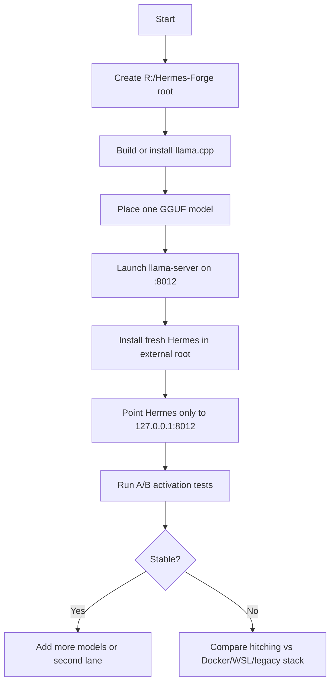

# Clean External `llama.cpp` Lane Runbook

- Date: 2026-06-11
- Author: Northstar
- Purpose: Stand up a clean, isolated bare-metal inference lane for a fresh
  Hermes install without contaminating the current Onyx stack

## Goal

Build a fully separate inference lane on another drive so you can:

- install a fresh Hermes outside the Onyx stack
- load `DeepSeek v4 Pro` or `Qwen` as a rebuild workhorse
- test model activation without Docker as the first variable
- avoid collisions with the current broken ports and profile stores

## Decision Summary

Use `llama.cpp` first, not AnythingLLM.

Reason:

- `llama.cpp` is the cleaner inference boundary for A/B testing
- AnythingLLM is useful later, but it adds another orchestration/UI layer
- we want one clean runtime, one clean model store, one clean port, and one
  clean Hermes install

## Preflight

Before starting, keep these boundaries:

- leave `L:\WSL` unchanged
- leave current Ollama on `11434` unchanged
- leave Commander/Apollo Telegram ownership unchanged for now
- do not reuse `$USER_HOME\.hermes\profiles\commander`
- do not reuse `$USER_HOME\.hermes\profiles\apollo`

## Folder Layout

Choose the new drive. This runbook uses `R:\Hermes-Forge` as the example.

```text
R:\Hermes-Forge
|-- docs
|-- hermes
|   |-- profiles
|   |   `-- baremetal-commander
|   |-- logs
|   `-- state
|-- llama.cpp
|   |-- build
|   |-- bin
|   `-- scripts
|-- logs
|   |-- llama-server
|   `-- test-runs
|-- models
|   |-- deepseek
|   `-- qwen
`-- scratch
```

## Port Plan

Use these new ports:

- `8012`
  - primary external `llama.cpp` lane
- `8013`
  - optional secondary lane
- `9102`
  - optional future metrics

Do not use:

- `3000`, `3001`, `3006`, `3210`
- `8089`, `8092`
- `8642`, `8643`, `8644`, `8645`, `8646`
- `9090`, `9119`
- `11434`

## Step-by-Step Build

### 1. Create the external root

Create:

- `R:\Hermes-Forge`
- `R:\Hermes-Forge\models`
- `R:\Hermes-Forge\logs`
- `R:\Hermes-Forge\hermes`

### 2. Install or build `llama.cpp`

Use the official repo and build instructions:

- [llama.cpp build docs](https://github.com/ggml-org/llama.cpp/blob/master/docs/build.md)
- [llama.cpp server docs](https://github.com/ggml-org/llama.cpp/blob/master/tools/server/README.md)

Target outcome:

- a local `llama-server` binary under:
  - `R:\Hermes-Forge\llama.cpp\bin`

### 3. Place the model

Put your chosen GGUF into one of:

- `R:\Hermes-Forge\models\deepseek`
- `R:\Hermes-Forge\models\qwen`

Keep model families separated so benchmarks stay legible.

### 4. Start `llama-server` on a clean port

Use a fresh port such as `8012`.

Conceptually:

- bind server to `127.0.0.1:8012`
- point to exactly one GGUF
- log to `R:\Hermes-Forge\logs\llama-server`

### 5. Install fresh Hermes separately

Install Hermes into:

- `R:\Hermes-Forge\hermes`

Its profile/state should live only under:

- `R:\Hermes-Forge\hermes\profiles\baremetal-commander`

Do not point it at:

- `$USER_HOME\.hermes\profiles\commander`
- `$USER_HOME\.hermes\profiles\apollo`

### 6. Point Hermes to the new endpoint only

The only model endpoint for this test lane should be:

- `http://127.0.0.1:8012`

Do not attach:

- Telegram
- Commander production gateway
- Apollo production gateway
- Onyx cron
- Jarvis launch surfaces

### 7. Run A/B tests

Measure these separately:

1. Idle baseline
   - Task Manager
   - `nvidia-smi`
   - `nvtop`
   - `vmmemWSL`
2. Start `llama-server` only
3. Load one model only
4. Query via direct HTTP or test client only
5. Query via fresh Hermes only

Record:

- GPU memory growth
- CPU spike
- desktop hitch severity
- `vmmemWSL` change
- whether Docker changes at all

## Flowchart



## Recommended First Test Order

1. `llama.cpp` only
2. `llama.cpp` plus direct prompt calls
3. `llama.cpp` plus fresh Hermes
4. only after that, consider second isolated Ollama

## Why Not AnythingLLM First

AnythingLLM is better treated as a later consumer layer for:

- documents
- workspaces
- lightweight RAG
- model switching

It should not be the first rebuild variable because it would add:

- another UI
- another state surface
- another integration layer

## Success Condition

The first milestone is simple:

- one clean model runtime
- one clean profile store
- one clean port
- zero shared legacy state
- reproducible activation behavior

If that becomes stable, it becomes the safe workhorse lane for rebuilding the
rest of the system.


