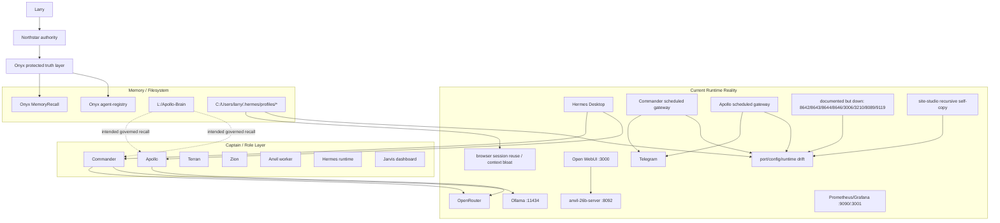
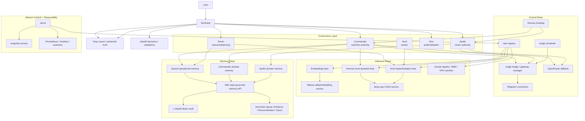
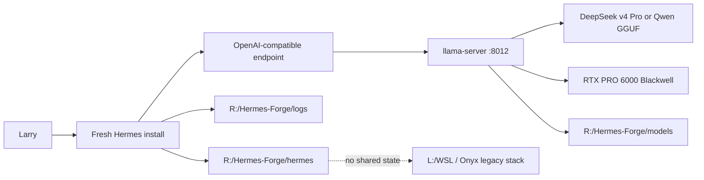

# Northstar Research Brief

- Date: 2026-06-11
- Author: Northstar
- Scope: Local Hermes / Apollo / Anvil / Onyx / Jarvis stack on `L:\WSL`, `L:\Jarvis`, `L:\Apollo-Brain`, and local Hermes profile state under `C:\Users\larry\.hermes`
- Purpose: Summarize the current technical stack, intended framework, observed failures, evidence-backed diagnosis, and the decision point between salvage and clean rebuild

## Executive Summary

The stack is best understood as a **Northstar-governed multi-lane AI operating
system** that was intended to separate:

- authority and truth
- orchestration and messaging
- local model execution
- mission control and observability
- durable memory and canon

That design intent was strong. The implementation drifted.

The most important conclusion from the investigation is:

**The primary failure is not the GPU path. The primary failure is control-plane
boundary collapse.**

The local model and observability surfaces are the healthiest parts of the
system:

- `3000` Open WebUI
- `8092` llama.cpp CUDA lane
- `11434` native Ollama
- `9090` Prometheus
- `3001` Grafana

The broken surfaces cluster around:

- Hermes control plane
- scheduled gateway ownership
- Commander/Apollo runtime state
- Telegram polling ownership
- session reuse / context resumption
- Jarvis control-plane assumptions
- recursive workspace duplication in `site-studio`

Based on the evidence, a **clean rebuild with backups** is now the leading
recommendation. The stack has too many overlapping stale-state, ownership, and
path-contamination failures to trust incremental repair as the primary path.

## Research Questions

This brief answers five practical questions:

1. What is the current technical stack?
2. How was the framework intended to work?
3. What is actually broken?
4. What are the most likely root causes?
5. Should the system be salvaged in place or rebuilt from a clean base?

## Method

Evidence was gathered from:

- live local listeners and containers
- scheduled task configuration and task history
- Hermes profile state and logs
- Onyx role and authority documentation
- Jarvis dashboard code and runtime assumptions
- `site-studio` source and filesystem state
- newly written inventory and cleanup tooling under `L:\AI-Stack`
- repeated timestamped check-ins stored in:
  - `C:\Users\larry\Documents\Troubleshoot\checkins`

This was a direct system audit, not a theoretical architecture review.

## Current Technical Stack

### 1. Governance / Truth Layer

Primary source:

- `L:\WSL\Onyx`

Key parts:

- `agent-registry`
- `Requests`
- `MemoryRecall`
- `captain-decisions`
- `changelists`

Observed role model:

- `Northstar`
  - supervising architect
  - workflow authority
  - approval/validation authority
  - truth owner
- `Terran`
  - research and implementation planning captain
- `Zion`
  - audit / validation / second-opinion captain
- `Anvil`
  - worker lane for transformation, summarization, drafting, sanity checks
- `Hermes`
  - adjacent runtime / automation layer

This part of the system is conceptually strong and relatively coherent.

### 2. Local Hermes Runtime Layer

Primary locations:

- `C:\Users\larry\.hermes\hermes-agent`
- `C:\Users\larry\.hermes\profiles\commander`
- `C:\Users\larry\.hermes\profiles\apollo`

Observed characteristics:

- shared runtime install under one `hermes-agent` tree
- per-profile state directories
- scheduled task launchers for profile gateways
- gateway state, lock, PID, logs, session, and desktop ledgers

This is where the largest concentration of operational failure exists.

### 3. Inference Layer

Observed live local services:

- Open WebUI on `3000`
- llama.cpp CUDA container on `8092`
- Ollama on `11434`

Observed containers:

- `gemma4-open-webui`
- `anvil-26b-server`
- `onyx-prometheus`
- `onyx-grafana`

Current condition:

- healthier than the control plane
- still not fully aligned with older docs
- not the main source of instability so far

### 4. Mission Control Layer

Primary location:

- `L:\Jarvis\dashboard`

Intent:

- dashboard on `3006`
- `/api/system/snapshot`
- lane/model/memory/service awareness
- command center for mission control

Observed condition:

- codebase exists
- runtime expected by docs/tests does not currently exist live
- another example of healthy assumptions disconnected from current runtime

### 5. Memory / Knowledge Layer

Primary location:

- `L:\Apollo-Brain`

Observed assets:

- large Obsidian-style vault
- OB1 recipes and integrations
- local embedding pathways
- memory and retrieval patterns already available for future governed recall

Assessment:

- this is worth preserving
- this should become the stable knowledge substrate in a rebuild

### 6. Site Studio / Workflow Layer

Primary location:

- `L:\WSL\site-studio`

Intent:

- import, edit, preview, export websites / workflows

Observed condition:

- recursive self-copy contamination exists on disk
- import logic is compatible with the failure mode
- current project tree cannot be treated as a clean live workspace

## Designed Framework

The framework was not random. It was designed as a **multi-lane authority
system** with role separation.

### Intended Role Hierarchy

The intended rule set is:

- captains own truth
- workers prepare and transform
- Hermes provides runtime and automation
- Jarvis provides visibility
- canon is separate from runtime

### Intended Lane Meanings

- `Northstar`
  - final architectural and truth authority
- `Commander`
  - machine posture, personal assistant operations, local control
- `Apollo`
  - canon, doctrine, promotion into truth
- `Terran`
  - research and planning
- `Zion`
  - audit and validation
- `Anvil`
  - local workhorse implementation lane
- `Hammer`
  - Anvil outside Onyx boundary
- `Hermes`
  - persistent runtime / automation / messaging layer
- `Jarvis`
  - telemetry / dashboard / launchpad / mission control
- `Mercury`
  - remote edge/VPS deployment identity

### Intended Architectural Pattern

The intended pattern was:

1. Keep truth and governance in Onyx
2. Use Hermes for runtime and message delivery
3. Use local lanes for model execution
4. Use Jarvis as an observer and operator shell
5. Attach Apollo-Brain as governed memory rather than dumping whole vaults into prompts

This architecture is valid in principle.

## Current Live State

### Live Listeners Repeatedly Confirmed

- `3000` Open WebUI
- `3001` Grafana
- `8092` llama.cpp CUDA lane
- `9090` Prometheus
- `11434` native Ollama

### Repeatedly Missing Surfaces

- `3006` Jarvis dashboard
- `3210` Site Studio UI
- `8089` documented Gemma/Anvil utility lane
- `8642` Hermes main API
- `8643` Hermes bridge API
- `8644` Commander API
- `8645` older broken Apollo/API-server evidence
- `8646` Apollo API
- `9119` Hermes browser cockpit

### What This Means

The local stack still has a working model path and partial observability, but
the intended operator/control-plane surfaces are mostly absent.

## Key Problems

### 1. Control-Plane Ownership Drift

This is the dominant failure.

Observed symptoms:

- scheduled gateway tasks exist as if they are the official owners
- the control-plane ports are not live
- profile state files still claim healthy runtime after the processes are dead
- Commander and Apollo ownership assumptions drifted over time

Implication:

- the system lost a single trustworthy source of runtime ownership

### 2. Stale Runtime Truth

Observed symptoms:

- `gateway.pid` contains stale dead PIDs
- `gateway_state.json` can still say `running`
- `gateway_state.json` can still report connected `api_server` or `telegram`
  state after the process is gone

Implication:

- the legacy Hermes runtime cannot be trusted to self-report health accurately

### 3. Duplicate Telegram Polling / Overlapping Gateway Copies

Observed symptoms:

- repeated Telegram polling conflicts
- explicit `getUpdates` conflict errors

Implication:

- at least two owners were active or believed to be active against the same bot
  surface

### 4. Shared Runtime Update Drift

Observed symptoms:

- failed Hermes update attempts because gateway/runtime still held venv files open
- update logs telling the operator to stop gateway before retrying
- shared runtime activity before the failure window
- profile launchers rewritten together around the same maintenance period

Implication:

- the runtime likely experienced partial or dirty maintenance while still live

### 5. Session Reuse / Context Bloat

Observed symptoms:

- explicit doc says `/chat` restored `claude-last-session` from localStorage
- Commander desktop/session state mixes many surfaces and model eras
- Commander has a much larger cross-surface session backlog than Apollo

Implication:

- what looked like “context randomly exploding” is more likely session
  continuity crossing boundaries that were supposed to be cleaner

### 6. Recursive Workspace Duplication

Observed symptoms:

- `site-studio` project tree contains nested copies of itself
- about `440` matching nested directories observed
- import code uses `copytree` and is compatible with the failure mode

Implication:

- that workspace is contaminated
- path recursion and accidental self-ingestion are real, not hypothetical

### 7. API Surface and Health Check Drift

Observed symptoms:

- old runtime evidence on `8645`
- current Apollo config on `8646`
- bridge and health-check logs show `404`, `200`, and invalid-key probes across
  different periods
- local callers probed `/v1/models` with wrong auth assumptions

Implication:

- not only services drifted; their expected probe/auth behavior drifted too

### 8. Jarvis Reality Gap

Observed symptoms:

- Jarvis dashboard code expects a live `3006` shell and structured system
  snapshot
- runtime is absent
- code assumes richer lane/model/service world than the machine exposes

Implication:

- Jarvis currently reflects intended design better than actual runtime truth

## What Is Not the Main Problem

The audit does **not** support the GPU as the leading cause.

### Why the GPU Theory Is Secondary

Evidence against “GPU is the main break”:

- Unreal and heavy art workloads run without the same failure profile
- local CUDA-backed lane on `8092` stays alive
- Ollama stays alive
- Open WebUI stays alive
- observability stays alive
- the dead surfaces cluster around control-plane and state management

That does not fully clear driver or memory-placement issues for future tuning,
but it strongly lowers them as the primary system-wide explanation.

## Current Root-Cause Ranking

1. Ownership drift between documented roles and actual runtime surfaces
2. Shared Hermes runtime drift plus dirty update/launch lifecycle
3. Scheduler/launcher failure for profile gateways
4. Stale profile runtime truth (`gateway.pid`, `gateway_state.json`)
5. Commander-side mixed session accumulation across sources and models
6. Duplicate gateway/control-plane copies and Telegram conflicts
7. Recursive workspace duplication in `site-studio`
8. Browser `/chat` localStorage resume behavior
9. Inconsistent local API probing and bridge expectations
10. OpenRouter throttling amplified by orchestration behavior
11. GPU/driver issue as secondary rather than primary

## Salvage vs Clean Rebuild

### Option A: Incremental Salvage

Potential advantages:

- less immediate disruption
- preserves current paths and launcher habits
- smaller short-term migration effort

Risks:

- stale state remains mixed with future state
- contaminated workspaces continue to mislead operators
- old ownership assumptions keep reappearing
- difficult to prove when the repaired system is actually clean
- high chance of spending more time on archaeology than on architecture

Assessment:

- technically possible
- strategically weak

### Option B: Clean Rebuild With Backups

Potential advantages:

- resets ownership, directory structure, and launch logic
- makes lane registry and role boundaries explicit from day one
- allows old artifacts to be preserved as evidence without being live runtime
- easiest way to eliminate recursive workspace contamination
- safest path for introducing revised hierarchy, Docker layout, and governed memory

Risks:

- requires disciplined backup and cutover
- some convenience/history will be separated from live runtime
- short-term rebuild overhead

Assessment:

- strongest option
- best aligned with the evidence

## Recommendation

### Primary Recommendation

Proceed with a **clean rebuild from backups**, not an in-place rescue as the
main strategy.

### Why

The current stack has too many simultaneous low-trust properties:

- stale runtime truth
- launcher ownership drift
- profile/state contamination
- mixed session history
- recursive workspace duplication
- documentation/runtime mismatch

At this point, the system is not merely broken; it is **epistemically
unreliable**. That is the key threshold.

When the problem is not only failure but also loss of trustworthy state, a clean
rebuild becomes the higher-confidence engineering move.

## What to Preserve Before Rebuild

Back up these categories first:

### Keep

- `L:\Apollo-Brain`
- `L:\WSL\Onyx`
- selected `MemoryRecall`, `Requests`, `captain-decisions`, `agent-registry`
- Jarvis dashboard code
- model manifests / benchmark notes worth preserving
- selected Hermes logs that explain failure modes
- selected profile session artifacts needed for forensic review only

### Preserve as Evidence, Not Live Runtime

- `C:\Users\larry\.hermes\profiles\commander`
- `C:\Users\larry\.hermes\profiles\apollo`
- `L:\WSL\site-studio`
- old scheduled task definitions
- old runtime bridge logs

### Do Not Treat as Clean Live Sources

- recursive `site-studio` project trees
- stale `gateway.pid`
- stale `gateway_state.json`
- old control-plane ports/docs as operational truth

## Proposed Rebuild Direction

### Fresh Root

Use the new scaffold:

- `L:\AI-Stack`

With distinct areas for:

- governance
- control-plane
- inference
- memory-plane
- mission-control
- observability
- ops

### Runtime Truth

Use machine-readable registry first:

- lane registry
- authority model
- network ledger

### Local Workhorse Direction

Bias the rebuild toward:

- `Qwen`
- `DeepSeek v4`

for the rebuild workhorse path, while preserving:

- bounded write surfaces
- governed promotion
- Northstar/Apollo truth authority

### Folder / Runtime Principles

- one owner per gateway
- one source of truth per lane
- one clean scheduler
- one explicit mission-control registry
- no importer may copy a managed project tree back into itself
- no session surface should silently inherit old chat identity by default

## Suggested Execution Sequence

1. Freeze and back up the keep set
2. Archive old runtime evidence
3. Build fresh Docker/runtime surfaces from `L:\AI-Stack`
4. Bring up one control-plane owner at a time
5. Re-establish inference lanes
6. Re-bind Apollo-Brain through governed retrieval
7. Rebuild Jarvis against the new registry, not old assumptions
8. Add secondary machine, Sparks, and VPSs only after local single-box stability

## Questions For Terran Review

Terran should pressure-test:

1. Whether any part of the current Hermes runtime is worth preserving live, not
   just as evidence
2. Whether Commander should remain the primary Telegram owner in the rebuild
3. Whether Apollo should remain API-only by default in the next version
4. Whether `Qwen` or `DeepSeek v4` should be the primary rebuild workhorse
5. Whether any current Jarvis code should be preserved directly versus rebuilt
   against the new registry contracts
6. Whether any `site-studio` data is worth extracting before full retirement of
   the old project tree

## Final Conclusion

The investigation does not show a hopeless architecture. It shows a good
architecture that lost operational discipline.

The main lessons are:

- the lane model was conceptually right
- the truth/runtime split was conceptually right
- the memory/governance separation was conceptually right
- the implementation allowed too much ownership drift, sticky state, and
  cross-surface contamination

If the goal is a dependable long-term operating system for local assistants,
content production, mission control, and distributed AI work, this is the right
moment to:

- back up the knowledge you want
- preserve the evidence you need
- rebuild the runtime cleanly
- enforce the revised hierarchy from the start

## Appendix A: Preserved Thread Notes

This appendix captures important operational context from the investigation so
it does not get lost in chat history.

### Hardware and Workload Context

- Primary workstation:
  - `NVIDIA RTX PRO 6000 Blackwell Workstation Edition`
  - approximately `96 GB` system RAM available to the board/workstation context
- Secondary machine:
  - `4080`-class NVIDIA GPU
- Additional nodes:
  - two NVIDIA Sparks
  - two Hostinger VPSs
- Known stable creative workload behavior:
  - large Unreal scene use was stable
  - `12k` image upscaling was stable
- Implication:
  - general workstation horsepower is not the limiting factor
  - hitching is more likely triggered by runtime activation, memory remap, or
    orchestration behavior than by raw lack of compute

### Runtime Identity and Nickname Map

- `Northstar`
  - authoritative supervisor role
- `Commander`
  - local machine authority
  - Hermes-facing operator when outside the protected Onyx stack
- `Apollo`
  - Onyx truth/canon operator
- `Terran`
  - research and implementation planning captain
- `Zion`
  - audit and second-opinion captain
- `Anvil`
  - local workhorse worker lane
  - Gemma-associated code name in current stack context
- `Hermes`
  - persistent adjacent runtime and automation layer
- `Jarvis`
  - mission control and visibility layer
- `Mercury`
  - VPS-hosted Hermes deployment identity
- Color names such as `Onyx`, `Amber`, and others
  - lane/repo identities and should be treated as purpose-bound contracts

### User-Supplied Operational Clues

- Whole-machine hitching appeared when the local agent stack activated, even
  when cloud-facing chat alone should not have required heavy local inference.
- Mercury-side Telegram/OpenRouter activity reportedly produced a burst on the
  order of `80k` tokens per second for roughly `3` seconds before throttling,
  indicating runaway control-plane or message fan-out behavior was plausible.
- The current stack should be treated as broadly low-trust. Brokenness is not
  isolated to one repo or one service.
- You are open to:
  - backing up the evidence and datasets worth keeping
  - rebuilding from a clean base
  - using a separate bare-metal workhorse outside the Onyx tree during rebuild
- Current rebuild workhorse preference:
  - `Qwen`
  - `DeepSeek v4 Pro`

### Hitching Hypothesis

The current evidence supports this host-side hypothesis:

`model activation -> WSL/Docker/runtime wake -> memory remap and allocation burst -> CPU stall + desktop hitch`

This is consistent with:

- `vmmemWSL` carrying a large memory footprint
- Docker Desktop backends being materially active
- the GPU already holding significant VRAM at low compute utilization
- multiple stale and duplicated runtime surfaces waking or claiming ownership

### Latest Boundary Verification

Confirmed during the most recent host check:

- WSL distro `PopOS` is running under WSL2
- `docker-desktop` WSL distro is also running
- live containers:
  - `gemma4-open-webui`
  - `anvil-26b-server`
  - `onyx-prometheus`
  - `onyx-grafana`
- inside the `PopOS` WSL instance:
  - `/etc/os-release` reports `Ubuntu 24.04.4 LTS`
  - `nvidia-smi` is available through `/usr/lib/wsl/lib/nvidia-smi`
  - `nvtop` is now installed
- on Windows:
  - `memreduct` is present and running

## Appendix B: Current Ports and Collision Risks

### Currently Live

- `3000`
  - Open WebUI
- `3001`
  - Grafana
- `8092`
  - `anvil-26b-server` llama.cpp CUDA container
- `9090`
  - Prometheus
- `11434`
  - native Ollama

### Documented or Historically Used but Not Reliably Live

- `3006`
  - Jarvis dashboard target
- `3210`
  - Site Studio UI target
- `8089`
  - documented Gemma/Anvil utility lane
- `8642`
  - Hermes main API
- `8643`
  - Hermes bridge API
- `8644`
  - Commander API
- `8645`
  - historical Apollo/API conflict port
- `8646`
  - Apollo API
- `9119`
  - Hermes browser cockpit

### Ports To Avoid For New Clean Lanes

Do not use these for the external rebuild workhorse lane:

- `3000`
- `3001`
- `3006`
- `3210`
- `8089`
- `8092`
- `8642`
- `8643`
- `8644`
- `8645`
- `8646`
- `9090`
- `9119`
- `11434`

### Recommended Fresh Ports

For isolated rebuild work:

- `8012`
  - preferred first `llama.cpp` external lane
- `8013`
  - optional second isolated inference lane
- `11435`
  - optional second Ollama lane if ever needed later
- `9102`
  - optional future metrics for the external lane

## Appendix C: Current-State and Target-State Graphs

### Current Drift Map



### Target Rebuild Map



## Appendix D: External Bare-Metal Workhorse Graph

This is the recommended temporary rebuild lane outside the broken Onyx runtime.



## Appendix E: External Lane Folder Structure

Recommended external root on the other drive:

```text
R:\Hermes-Forge
|-- docs
|   |-- external-lane-runbook.md
|   `-- benchmarks
|-- hermes
|   |-- profiles
|   |   `-- baremetal-commander
|   |-- logs
|   `-- state
|-- llama.cpp
|   |-- build
|   |-- bin
|   `-- scripts
|-- logs
|   |-- llama-server
|   `-- test-runs
|-- models
|   |-- deepseek
|   `-- qwen
`-- scratch
    |-- prompts
    `-- outputs
```

## Appendix F: What To Avoid During Rebuild

- Do not point a fresh Hermes install at `C:\Users\larry\.hermes\profiles\commander`
  or `apollo`.
- Do not reuse the current Onyx Telegram bot polling surfaces during testing.
- Do not bind new inference services to old stack ports.
- Do not let a new workhorse lane write into `L:\WSL`.
- Do not install AnythingLLM first. It adds another UI/control layer before the
  inference boundary is stabilized.
- Do not assume a "new chat" surface is actually a new session unless its state
  store is verified.
- Do not let Docker, WSL, Ollama, and Hermes all be part of the same first A/B
  test. Change one variable at a time.
